# 🧠 RAG-Based Document Q&A System

<div align="center">


**A powerful Retrieval-Augmented Generation (RAG) system that enables intelligent document Q&A with real-time responses, citations, and advanced summarization capabilities.**

[ Quick Start](#-quick-start) • [ Features](#-features) • [ Architecture](#️-architecture) • [ Tech Stack](#️-tech-stack) • [ API Reference](#-api-reference)

</div>

---
## 🎥 Demo Video  
[Watch the demo here](https://trideep1315.sirv.com/PDF%20Q%26A%20App%20-%20Google%20Chrome%202025-09-08%2011-07-18.mp4)


##  Features

<table>
<tr>
<td>

### 📄 **Document Processing**
- **Multi-format support**: PDF, DOCX, CSV, XLSX, PNG
- **Advanced OCR**: Image-based PDFs and scanned documents  
- **Smart chunking**: Preserves context and metadata
- **Page-level tracking**: Precise citations with snippets

</td>
<td>

### 🤖 **AI-Powered Q&A**
- **Context-aware responses**: Maintains chat history
- **Real-time streaming**: Typing effect for answers
- **Citation system**: Page numbers and source snippets
- **Multi-level summarization**: Short, medium, detailed

</td>
</tr>
<tr>
<td>

###  **Search & Retrieval**
- **Semantic search**: ChromaDB vector database
- **Sentence Transformers**: High-quality embeddings
- **Similarity matching**: Relevant context retrieval
- **Performance optimized**: Fast query processing

</td>
<td>

###  **Modern Interface**
- **Responsive design**: Works on all devices
- **Dark/Light themes**: User preference support
- **Real-time updates**: Streaming responses
- **Intuitive UX**: Clean, professional interface

</td>
</tr>
</table>

---

## 🏗 Architecture

### System Flow Diagram

```mermaid
graph TB
    subgraph "Frontend Layer"
        U[👤 User] --> F[ Next.js Frontend]
        F --> FU[ File Upload]
        F --> CUI[ Chat Interface]
    end
    
    subgraph "Backend Services"
        FU --> B[ FastAPI Backend]
        CUI --> B
        B --> DP[ Document Processing]
        B --> ASK[ Question Processing]
    end
    
    subgraph "Document Pipeline"
        DP --> OCR[ OCR Extraction]
        DP --> TXT[ Text Chunking]
        TXT --> EMB[ Embedding Generation]
        EMB --> DB[ ChromaDB Vector Store]
    end
    
    subgraph "AI Processing"
        ASK --> QP[ Query Processing]
        QP --> RET[ Context Retrieval]
        RET --> LLM[ Google Gemini LLM]
        LLM --> RESP[ Answer + Citations]
        RESP --> STREAM[ Streaming Response]
    end
    
    DB --> RET
    STREAM --> CUI

    style U fill:#e1f5fe
    style LLM fill:#fff3e0
    style DB fill:#f3e5f5
    style STREAM fill:#e8f5e8
```



### 📊 Processing Pipeline

```
 Document Upload →  Text Extraction →  Chunking →  Embeddings →  Vector Store → 
 User Query →  Similarity Search →  LLM Processing →  Streamed Response
```

---

## 🛠 Tech Stack

<details>
<summary><b>🔧 Backend Technologies</b></summary>

| Component | Technology | Purpose |
|-----------|------------|---------|
| **Web Framework** | FastAPI | High-performance async API |
| **LLM Provider** | Google Gemini 2.5 Flash | Question answering & summarization |
| **Vector Database** | ChromaDB | Semantic search & retrieval |
| **Embeddings** | Sentence Transformers | Text-to-vector conversion |
| **Document Processing** | pdfplumber, PyMuPDF | PDF text extraction |
| **OCR Engine** | Tesseract + pdf2image | Image-based text recognition |
| **Office Docs** | python-docx, openpyxl | Word & Excel processing |

</details>

<details>
<summary><b>  Frontend Technologies</b></summary>

| Component | Technology | Purpose |
|-----------|------------|---------|
| **Framework** | Next.js 13.5 | React-based web application |
| **Language** | TypeScript | Type-safe development |
| **Styling** | Tailwind CSS | Utility-first CSS framework |
| **UI Components** | shadcn/ui + Radix UI | Modern component library |
| **Markdown** | react-markdown + KaTeX | Rich text rendering |
| **HTTP Client** | Fetch API | Backend communication |

</details>

---

##  Quick Start

###  Prerequisites

```bash
# System Requirements
Python 3.12+
Node.js 18+
npm or yarn
Tesseract OCR
```

### ⚙️ Installation

#### 1️⃣ Backend Setup

```bash
# Navigate to backend directory
cd Backend

# Install Python dependencies
pip install -r requirements.txt

# Create environment file
cat > .env << EOF
GOOGLE_API_KEY=your_gemini_api_key_here
CHROMA_DB_DIR=.chroma
MEDIA_ROOT=media
EOF
```

#### 2️⃣ Frontend Setup

```bash
# Navigate to frontend directory
cd Frontend

# Install Node.js dependencies
npm install

# Create environment file
cat > .env.local << EOF
NEXT_PUBLIC_API_URL=http://localhost:8000
EOF
```

###  Running the Application

#### Terminal 1 - Backend Server
```bash
cd Backend
python main.py
#  Server running at http://localhost:8000
```

#### Terminal 2 - Frontend Server
```bash
cd Frontend
npm run dev
#  Application available at http://localhost:3000
```

---

## 📁 Project Structure

```
RAG-Document-QA/
├── 📁 Backend/
│   ├── 🐍 main.py              # FastAPI application entry point
│   ├── 🧠 rag.py               # Core RAG logic and processing
│   ├── 📄 pdf_utils.py         # Document processing utilities
│   ├── 📋 requirements.txt     # Python dependencies
│   ├── 🔧 .env                 # Environment configuration
│   └── 📁 media/               # Uploaded document storage
│
├── 📁 Frontend/
│   ├── 📁 app/
│   │   └── 📄 qa/page.tsx      # Main Q&A interface
│   ├── 📁 components/
│   │   ├── 💬 ChatUI.tsx       # Chat interface component
│   │   └── 📤 FileUploader.tsx # File upload component
│   ├── 📁 lib/
│   │   └── 🔧 api-config.ts    # API configuration
│   └── 🔧 .env.local           # Frontend environment
│
└── 📖 README.md                # This file
```

---

## 📖 API Reference

### 🔗 Endpoints

| Method | Endpoint | Description | Response |
|--------|----------|-------------|----------|
| `POST` | `/upload` | Upload and process documents | Document metadata |
| `POST` | `/ask` | Ask questions (complete response) | JSON with answer & citations |
| `POST` | `/ask_stream` | Ask questions (streaming) | Server-sent events |
| `POST` | `/summarize` | Generate document summaries | Summary text |
| `GET` | `/health` | Health check and database status | System status |

###  Request Examples

<details>
<summary><b>Document Upload</b></summary>

```bash
curl -X POST "http://localhost:8000/upload" \
  -F "file=@document.pdf"
```

</details>

<details>
<summary><b>Ask Question</b></summary>

```bash
curl -X POST "http://localhost:8000/ask" \
  -H "Content-Type: application/json" \
  -d '{"question": "What is the main topic of this document?"}'
```

</details>

<details>
<summary><b>Summarization</b></summary>

```bash
curl -X POST "http://localhost:8000/summarize" \
  -H "Content-Type: application/json" \
  -d '{"summary_type": "medium"}'
```

</details>

---

##  Advanced Features

###  **Smart Document Processing**
- **Intelligent OCR**: Automatic fallback for scanned documents
- **Context Preservation**: Maintains document structure and relationships
- **Metadata Extraction**: Page numbers, sections, and source tracking

###  **Enhanced Q&A Experience**
- **Streaming Responses**: Real-time answer generation with typing effect
- **Citation System**: Precise page references with relevant snippets  
- **Chat Memory**: Contextual conversations with history retention
- **Multi-level Summaries**: Customizable summary depth (short/medium/detailed)

###  **Modern User Interface**
- **Responsive Design**: Optimized for desktop, tablet, and mobile
- **Theme Support**: Dark and light mode with user preference memory
- **Interactive Elements**: Smooth animations and transitions
- **Accessibility**: WCAG compliant design patterns

---

## 🚧 Roadmap & Future Enhancements

- [ ] ** Multi-language Support**: OCR and LLM processing for various languages
- [ ] ** Analytics Dashboard**: Usage insights and document statistics  
- [ ] ** Collaboration Features**: Shared documents and team Q&A sessions
- [ ] ** Mobile App**: Native iOS/Android companion application
- [ ] ** Performance Scaling**: PostgreSQL/Redis integration for enterprise use
- [ ] ** Advanced Security**: User authentication and document access controls
- [ ] ** Custom Models**: Fine-tuned embeddings for domain-specific documents

---

## Contributing

We welcome contributions! Please feel free to submit a Pull Request. For major changes, please open an issue first to discuss what you would like to change.

### Development Guidelines
1. Fork the repository
2. Create a feature branch (`git checkout -b feature/AmazingFeature`)
3. Commit your changes (`git commit -m 'Add some AmazingFeature'`)
4. Push to the branch (`git push origin feature/AmazingFeature`)
5. Open a Pull Request

---

## License

This project is licensed under the MIT License - see the [LICENSE](LICENSE) file for details.

---

## Acknowledgments

- [Google Gemini](https://deepmind.google/technologies/gemini/) for powerful language model capabilities
- [ChromaDB](https://www.trychroma.com/) for efficient vector database operations
- [Sentence Transformers](https://www.sbert.net/) for high-quality embeddings
- [Next.js](https://nextjs.org/) and [FastAPI](https://fastapi.tiangolo.com/) for robust framework foundations

---

<div align="center">

**⭐ Star this repository if you find it helpful!**


</div>
